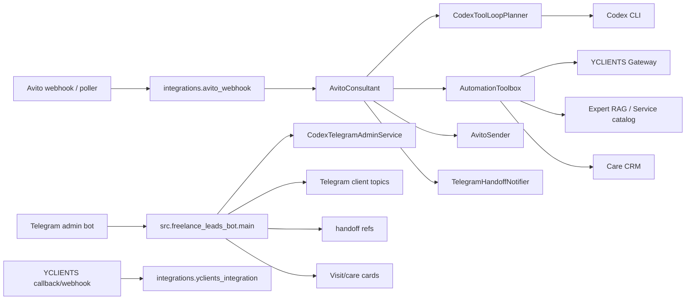

# AutomaticCosmetic: полная документация проекта

Обновлено: 2026-07-31.

AutomaticCosmetic - операционная система для косметолога Ольги: Avito-консультант, Telegram-админка, handoff-карточки, база знаний, YCLIENTS-интеграция, контроль зависших обещаний, контур заботы и допродаж после визитов.

Документ описывает активный проект в `/root/AutomaticCosmetic`. Архивы legacy-рантайма не считаются частью активной системы.

## 1. Назначение

Проект автоматизирует три основные зоны работы:

1. Avito-заявки: бот отвечает клиентам, уточняет город/услугу/дату, использует YCLIENTS и базу знаний, а сложные случаи передает Ольге.
2. Telegram для Ольги и администраторов: карточки ручной обработки, Codex-чат, управление флагами, клиентские темы, подтверждения визитов и задачи заботы.
3. Care/upsell: локальная CRM, факты визитов, follow-up после процедур, мягкие допродажи и контроль запрета контакта.

Главная идея системы: бот сам отвечает только там, где есть надежная опора в данных. Если нужен эксперт, фото, медицинская осторожность, адрес/запись с неопределенностью или ручное решение, создается handoff для Ольги.

## 2. Главные бизнес-правила

- YCLIENTS - источник правды по услугам, клиентам, записям, расписанию и адресам.
- Avito-бот не должен придумывать цены, города, даты, адреса, свободные окна или медицинские обещания.
- Цена берется только из Avito-объявления, подтвержденной базы знаний или YCLIENTS-цены со статусом known.
- Город нужен для записи, адреса и слотов, но не должен спрашиваться только ради цены.
- Города приема фиксируются в `BUSINESS_CITIES`.
- Точный адрес клиенту называется только после проверки через YCLIENTS/company address tool.
- Фото, жалобы, медицинские риски и вопросы результата по объему отправляются Ольге.
- Консультация не телефонная: клиент оставляет номер или аккаунт удобного мессенджера/соцсети, бот передает контакт Ольге, дальше консультация идет в переписке.
- Handoff-напоминания должны приходить с кнопками и в клиентскую Telegram-тему, если тема известна или может быть восстановлена.
- Критичные вопросы по записи, переносу, отмене, адресу, оплате и подтверждению времени нельзя закрывать без финального ответа клиенту или явного решения Ольги.
- Старые знания с датами, адресами, окнами и акциями без срока действия не должны попадать в автоответ.

## 3. Архитектура



### Основные потоки

1. Avito webhook получает событие `/avito/webhook`.
2. Событие дедуплицируется и превращается в `InboundMessage`.
3. `AvitoConsultant` собирает контекст: объявление, историю, RAG, YCLIENTS, роли, доступные tools.
4. Если `AVITO_CODEX_ENABLED=true`, Codex-планировщик делает tool loop: вызывает tools, читает результаты и возвращает финальное действие.
5. Ответ либо отправляется в Avito, либо пишется в preview outbox, либо создается handoff-карточка.
6. Если клиенту обещали “уточню/проверю”, монитор зависших обещаний следит, чтобы задача не потерялась.
7. Handoff и follow-up попадают Ольге в Telegram, желательно в отдельную клиентскую тему.

## 4. Структура репозитория

| Путь | Назначение |
|---|---|
| `src/freelance_leads_bot/` | основной Python-пакет |
| `src/freelance_leads_bot/main.py` | активный Telegram admin bot entrypoint |
| `src/freelance_leads_bot/integrations/` | Avito, YCLIENTS, RAG, CRM, VK, Telegram integrations |
| `src/freelance_leads_bot/miniapp_static/` | статический Mini App терминала |
| `scripts/` | диагностика, экспорты, мониторы, backup, ручные операции |
| `deploy/systemd/` | production systemd units и timers |
| `deploy/logrotate/` | logrotate-конфиг runtime-логов |
| `docs/` | документация и эксплуатационные заметки |
| `tests/test_integrations_foundation.py` | основной интеграционный regression suite |
| `data/` | живое runtime-состояние, логи, SQLite, JSON state; не коммитить |
| `backups/` | архивы runtime-data, если включен backup |

## 5. Ключевые модули

### Ядро

| Файл | Роль |
|---|---|
| `config.py` | базовые настройки Telegram/Codex/Mini App/сканера |
| `telegram.py` | тонкая обертка Telegram Bot API: сообщения, документы, фото, темы |
| `codex_runner.py` | запуск Codex CLI, auth/login, история Codex-чата, markdown/html conversion |
| `main.py` | polling Telegram admin bot, команды, callbacks, live drafts, handoff replies |
| `miniapp.py` | локальный Mini App сервер |
| `media_recognition.py` | распознавание голосовых/медиа для админки |
| `storage.py` | SQLite-хранилище лидов и истории |

### Integrations

| Файл | Роль |
|---|---|
| `config.py` | `IntegrationSettings`: все Avito/YCLIENTS/RAG/VK/Telegram integration env |
| `models.py` | доменные модели: `InboundMessage`, `Handoff`, `Appointment`, `Service`, `Slot` |
| `roles.py` | role profiles и правила поведения для Avito/Telegram/VK/Ольги |
| `agent_tools.py` | общий toolbox для Codex-агентов |
| `agent_trace.py` | редактированный JSONL trace tool-loop и решений |
| `avito_webhook.py` | FastAPI webhook Avito |
| `avito_consultant.py` | главный Avito-ответчик и fallback logic |
| `codex_planner.py` | prompt и JSON protocol для Codex tool-loop |
| `codex_review.py` | второй проход проверки клиентского ответа |
| `booking_flow.py` | fallback booking-flow, слоты, контакт, handoff на оформление |
| `avito_sender.py` | live/preview отправка сообщений в Avito |
| `avito_read.py` | чтение Avito chats/messages |
| `avito_history.py` | запись исходящих Avito и маскирование телефонов |
| `avito_turn_buffer.py` | debounce нескольких сообщений клиента в один turn |
| `avito_followup_admin.py` | кнопки и действия по зависшим Avito promises |
| `handoff_notify.py` | Telegram handoff notifier, SLA reminders, кнопки закрытия/отложить |
| `handoff_refs.py` | durable связь handoff-карточек с Avito чатами |
| `telegram_client_topics.py` | клиентские Telegram-темы по Avito-диалогам |
| `expert_rag.py` | SQLite expert RAG store |
| `expert_rag_admin.py` | планы изменения RAG по командам Ольги |
| `expert_rag_review.py` | CLI review/approve/deprecate RAG-знаний |
| `rag_retrieval.py` | retrieval поверх RAG и service catalog |
| `rag_manual_review.py` | ручные карточки проверки RAG autoanswer |
| `service_catalog.py` | структурированный каталог услуг |
| `care_crm.py` | локальная CRM, визиты, follow-up tasks, learning/preferences |
| `telegram_client_bot.py` | клиентский Telegram bot и delivery follow-ups |
| `telegram_admin_bot.py` | интеграционный transport/admin service helpers |
| `olga_manual_tasks.py` | ручные задачи Ольги и reminders |
| `city_schedule.py` | локальное расписание городов Ольги |
| `yclients.py` | YCLIENTS gateway: dry-run и HTTP |
| `yclients_integration.py` | FastAPI adapter для YCLIENTS webhook/callback/register |
| `vk.py`, `vk_bot.py`, `vk_sender.py` | VK preview/live канал |
| `ops_status.py` | единая read-only health/ops проверка |
| `runtime.py` | сборка gateway/toolbox из настроек |

## 6. Внешние входы и сервисы

### Telegram admin bot

Активный entrypoint:

```bash
.venv/bin/python -m src.freelance_leads_bot.main serve
```

Основные функции:

- команды `/menu`, `/status`, `/flags`, `/open_cards`, `/avito_followups`, `/care_followups`, `/visit_confirmations`;
- Codex-чат с live drafts;
- обработка кнопок handoff/follow-up/RAG/manual tasks;
- клиентские темы внутри Telegram-чата;
- отправка файлов/фото из Codex-ответа через directives;
- перезапуск бота после изменения флагов.

### Avito webhook

FastAPI app: `src.freelance_leads_bot.integrations.avito_webhook:app`.

Routes:

- `GET /health`;
- `POST /avito/webhook?token=<AVITO_WEBHOOK_SECRET>`.

Основная служба: `yclients-avito-webhook.service`.

### Avito missed poller

Служба: `yclients-avito-missed-poller.service`.

Назначение: читать последние Avito-чаты через API и подбирать сообщения, которые могли не прийти webhook-ом.

### Avito unanswered monitor

Служба: `yclients-avito-unanswered-monitor.service`.

Назначение:

- искать диалоги, где последний клиентский message без финального исходящего;
- отслеживать promises после фраз “уточню/проверю/вернусь”;
- создавать Telegram alerts;
- запускать delayed autoreply, если включено;
- обрабатывать SLA по handoff-карточкам.

### YCLIENTS integration

FastAPI app: `src.freelance_leads_bot.integrations.yclients_integration:app`.

Routes:

- `GET /health`;
- `GET/POST /yclients/webhook`;
- `GET/POST /yclients/callback`;
- `GET/POST /yclients/register`.

Служба: `yclients-yclients-integration.service`.

### Visit confirmations

Служба/timer: `yclients-visit-confirmations.service` и `yclients-visit-confirmations.timer`.

Назначение: прислать Ольге карточки проверки визитов, чтобы зафиксировать факт процедуры, препарат, объем, реакцию и рекомендации.

### Olga manual tasks

Служба/timer: `olga-manual-task-reminder.service` и `olga-manual-task-reminder.timer`.

Назначение: напоминать Ольге об открытых ручных задачах.

### Backup

Служба/timer: `automaticcosmetic-backup.service` и `automaticcosmetic-backup.timer`.

Назначение: архивировать runtime data и `.env` без записи в git.

## 7. Конфигурация

`.env` - единственный источник живых секретов. `.env.example` содержит только имена переменных и безопасные значения-заглушки.

### Базовые Telegram/Codex

| Переменная | Назначение |
|---|---|
| `TELEGRAM_BOT_TOKEN` / `TELEGRAM_ADMIN_BOT_TOKEN` | токен админского Telegram-бота |
| `TELEGRAM_CHAT_ID` | основной чат для Telegram admin bot |
| `TELEGRAM_ADMIN_USER_ID` | основной админ |
| `TELEGRAM_COSMETOLOGIST_USER_ID` | пользователь Ольги |
| `TELEGRAM_EXTRA_ADMIN_USER_IDS` | дополнительные админы |
| `ALLOWED_TELEGRAM_USERNAMES` / `ALLOWED_TELEGRAM_USER_IDS` | доступ к боту |
| `TELEGRAM_ADMIN_CODEX_ENABLED` | включает Codex для админки |
| `TELEGRAM_ADMIN_CODEX_TIMEOUT_SECONDS` | timeout Codex-ответа |
| `TELEGRAM_ADMIN_CODEX_MAX_STEPS` | лимит tool-loop шагов админки |
| `TELEGRAM_ADMIN_HISTORY_ENABLED` | хранить/использовать историю админ-чата |
| `MINIAPP_PUBLIC_URL`, `MINIAPP_HOST`, `MINIAPP_PORT` | Mini App terminal |
| `CODEX_BINARY`, `CODEX_WORKDIR`, `CODEX_OUTPUT_DIR` | путь и режим Codex CLI |

### Telegram client topics

| Переменная | Назначение |
|---|---|
| `TELEGRAM_CLIENT_TOPICS_ENABLED` | включает клиентские темы |
| `TELEGRAM_CLIENT_TOPICS_PATH` | обычно `data/telegram_client_topics.json` |
| `HANDOFF_NOTIFY_ENABLED` | включает Telegram handoff notifications |
| `HANDOFF_NOTIFY_CHAT_ID` | чат Ольги/админа, куда уходят карточки |

Важно: проект хранит соответствие Avito-диалога и Telegram `message_thread_id` в `data/telegram_client_topics.json`. Handoff SLA reminders сначала используют thread из `telegram_handoff_refs.json`, затем восстанавливают тему по Avito chat id из `telegram_client_topics.json`, затем создают тему, если нужно.

### Avito

| Переменная | Назначение |
|---|---|
| `AVITO_ACCOUNT_ID`, `AVITO_ACCOUNT_IDS` | один или несколько аккаунтов |
| `AVITO_CLIENT_ID`, `AVITO_CLIENT_SECRET` | OAuth/API |
| `AVITO_WEBHOOK_SECRET` | token для webhook |
| `AVITO_SEND_ENABLED` | live-отправка в Avito |
| `AVITO_IMAGE_SEND_ENABLED` | live-отправка изображений |
| `AVITO_CODEX_ENABLED` | Codex planner для Avito |
| `AVITO_CODEX_TIMEOUT_SECONDS` | timeout Avito planner |
| `AVITO_CODEX_MAX_STEPS` | production default 4 |
| `AVITO_TURN_DEBOUNCE_SECONDS` | задержка сборки turn из нескольких сообщений |
| `AVITO_UNANSWERED_AUTOREPLY_ENABLED` | delayed autoreply |
| `AVITO_UNANSWERED_MIN_AGE_SECONDS` | возраст диалога перед действием |
| `AVITO_OVERDUE_PROMISE_ERROR_AFTER_SECONDS` | SLA для критичных promises |

### YCLIENTS

| Переменная | Назначение |
|---|---|
| `YCLIENTS_API_KEY`, `YCLIENTS_USER_TOKEN` | доступ к API |
| `YCLIENTS_COMPANY_ID` | дефолтная компания |
| `YCLIENTS_*_COMPANY_ID` | company id по городам |
| `YCLIENTS_*_STAFF_ID` | staff id по городам |
| `YCLIENTS_PARTNER_ID`, `YCLIENTS_FORM_ID` | online booking/register |
| `YCLIENTS_PUBLIC_BASE_URL` | публичный домен |
| `YCLIENTS_INTEGRATION_SECRET` | защита callbacks |
| `YCLIENTS_ALLOW_MUTATIONS` | live-мутации записей/клиентов |

### RAG и каталог услуг

| Переменная | Назначение |
|---|---|
| `RAG_RETRIEVAL_ENABLED` | retrieval включен |
| `RAG_DYNAMIC_INTENT_ENABLED` | LLM/free-form команды Ольги по RAG |
| `RAG_SERVICE_CATALOG_ENABLED` | service catalog |
| `RAG_SHARED_RETRIEVAL_ENABLED` | общий retrieval контекст |
| `RAG_AUTOANSWER_THRESHOLD` | порог автоответа |
| `RAG_HANDOFF_THRESHOLD` | порог handoff |
| `RAG_EXPERT_DB_PATH` | SQLite RAG |
| `RAG_SERVICE_CATALOG_PATH` | JSON service catalog |
| `RAG_INTENT_LLM_TIMEOUT_SECONDS` | timeout intent LLM |

### VK

| Переменная | Назначение |
|---|---|
| `VK_GROUP_ID`, `VK_GROUP_TOKEN` | VK group Long Poll |
| `VK_API_VERSION` | версия VK API |
| `VK_SEND_ENABLED` | live-отправка VK |
| `VK_CODEX_ENABLED` | Codex planner для VK |

## 8. Runtime data

`data/` содержит живое состояние. Его нельзя чистить или коммитить без отдельной причины.

| Файл/группа | Назначение |
|---|---|
| `leads.sqlite3` | основная SQLite база лидов/истории |
| `care_crm.sqlite3` | локальная CRM, визиты, follow-ups, preferences |
| `expert_rag.sqlite3` | экспертная база знаний |
| `service_catalog.json` | структурированный каталог услуг |
| `bot_knowledge.json` | legacy/JSON knowledge |
| `agent_trace.jsonl*` | trace Codex/tool-loop с редактированием секретов |
| `bot_runtime.log*` | Telegram admin bot runtime log |
| `telegram_update_offset.txt` | offset polling Telegram |
| `telegram_handoff_refs.json` | handoff-карточки и статусы |
| `telegram_client_topics.json` | связь Avito chat -> Telegram topic/thread |
| `handoff_outbox.jsonl*` | preview handoff notifications |
| `avito_outbox.jsonl*` | preview Avito replies |
| `avito_processed_events.json` | дедуп Avito events |
| `avito_turn_buffer.json` | buffered Avito turns |
| `avito_client_names.json` | cache имен клиентов |
| `avito_unanswered_monitor_state.json` | состояние promises/unanswered monitor |
| `avito_unanswered_report.json` | текущий отчет по Avito хвостам |
| `avito_followup_audit.jsonl*` | аудит действий по promises |
| `avito_manual_replies.jsonl*` | ручные ответы/закрытия |
| `olga_manual_tasks.json` | ручные задачи Ольги |
| `city_schedule.json` | расписание городов |
| `mfa_totp.json` | локальный MFA secret store |
| `*_review.md` | рабочие markdown-файлы ручной проверки |

## 9. Handoff и клиентские темы

Handoff создается, когда бот не должен сам отвечать клиенту. Частые причины:

- `photo_consultation`;
- `human_requested`;
- `booking_ambiguous`;
- `booking_critical`;
- `complaint_or_risk`;
- `expert_expectation`;
- `voice_transcription_failed`;
- `missing_data`.

Карточка сохраняется в `data/telegram_handoff_refs.json` и отправляется в Telegram. Если включены client topics, бот создает или находит тему по ключу:

```text
avito:<account_id>:<external_chat_id>
```

SLA reminders:

- напоминание после заданного возраста open handoff;
- эскалация для critical handoff;
- кнопки `Закрыто`, `Не актуально`, `Напомнить позже`;
- восстановление темы из `telegram_client_topics.json`, если thread id потерян в handoff-ref.

## 10. RAG и знания

RAG используется для повторяемых ответов: цены, условия, подготовка, уход, противопоказания, сервисные нюансы, правила общения.

Статусы знаний:

- `approved` - можно использовать как подтвержденную опору;
- `needs_review` - нельзя использовать как autoanswer, нужно подтверждение;
- `deprecated` - устарело;
- `autoanswer_allowed=false` - знание можно оставить для контекста, но нельзя выдавать как прямой автоответ.

Высокорисковые знания и временные факты должны быть исключены из прямого Avito autoanswer без явного срока действия.

## 11. Care CRM и follow-up

Care CRM хранит:

- клиентов и transport identities;
- визиты и подтвержденные факты процедур;
- interactions/notes;
- preferences;
- follow-up tasks;
- learning lessons;
- do-not-contact и complaint risk flags.

Follow-up отправляется только если:

- нет запрета на контакт;
- нет жалобы/риска;
- есть канал связи;
- задача не заблокирована;
- отправка включена соответствующим feature flag.

## 12. Основные команды и скрипты

### Проверки

```bash
.venv/bin/python -m compileall -q src scripts
.venv/bin/python -m pytest -q
.venv/bin/python -m src.freelance_leads_bot.integrations.ops_status
.venv/bin/python -m src.freelance_leads_bot.integrations.ops_status --strict
.venv/bin/python -m src.freelance_leads_bot.integrations.ops_status --json
```

### Запуск локально

```bash
./setup_env.sh
./run_bot.sh
./run_once.sh
./run_avito_webhook.sh
./run_yclients_integration.sh
./run_telegram_client_bot.sh
./run_vk_bot.sh
```

### Avito

```bash
.venv/bin/python scripts/avito_unanswered_monitor.py --once
.venv/bin/python scripts/avito_unanswered_monitor.py --autoreply
.venv/bin/python scripts/export_avito_followups.py --output data/avito_followups_review.md
.venv/bin/python scripts/export_open_handoffs.py --output data/open_handoffs_review.md
.venv/bin/python scripts/export_avito_history_before.py --before 2026-06-01
```

### RAG

```bash
.venv/bin/python -m src.freelance_leads_bot.integrations.expert_rag_review list
.venv/bin/python -m src.freelance_leads_bot.integrations.expert_rag_review export --output data/expert_rag_review.md
.venv/bin/python -m src.freelance_leads_bot.integrations.expert_rag_review temporal-cleanup --output data/expert_rag_temporal_cleanup.md
.venv/bin/python scripts/send_rag_review_cards.py --limit 20
.venv/bin/python scripts/import_olga_history_to_rag.py --dry-run
.venv/bin/python scripts/service_catalog_admin.py seed
```

### Care/visits/tasks

```bash
.venv/bin/python scripts/send_visit_confirmations.py --quiet-empty
.venv/bin/python scripts/send_olga_task_reminders.py --limit 20
```

### Backup и диагностика

```bash
.venv/bin/python scripts/backup_runtime_data.py --data-dir data --output-dir backups
.venv/bin/python scripts/verify_runtime_backup.py --backup-dir backups
.venv/bin/python scripts/verify_logrotate_config.py
.venv/bin/python scripts/production_readiness_report.py --output data/production_readiness_report.md
scripts/live_smoke_check.sh
```

## 13. Systemd

| Unit | Тип | Назначение |
|---|---|---|
| `freelance-leads-bot.service` | long-running | Telegram admin bot |
| `yclients-avito-webhook.service` | long-running | Avito FastAPI webhook |
| `yclients-avito-missed-poller.service` | long-running | Avito missed message poller |
| `yclients-avito-unanswered-monitor.service` | long-running | unanswered/promise monitor |
| `yclients-yclients-integration.service` | long-running | YCLIENTS integration app |
| `yclients-visit-confirmations.service` | oneshot | daily visit confirmations |
| `yclients-visit-confirmations.timer` | timer | schedule visit confirmations |
| `olga-manual-task-reminder.service` | oneshot | reminders for Olga manual tasks |
| `olga-manual-task-reminder.timer` | timer | schedule manual task reminders |
| `automaticcosmetic-backup.service` | oneshot | runtime backup |
| `automaticcosmetic-backup.timer` | timer | schedule backups |

Базовая проверка:

```bash
systemctl is-active freelance-leads-bot.service yclients-avito-webhook.service yclients-avito-unanswered-monitor.service
journalctl -u freelance-leads-bot.service -n 200 --no-pager
journalctl -u yclients-avito-unanswered-monitor.service -n 200 --no-pager
```

## 14. Тестирование и CI

CI находится в `.github/workflows/tests.yml`.

Pipeline:

1. Python 3.12.
2. Установка `requirements.txt`, `requirements.dev.txt`, `requirements.integrations.txt`.
3. `bash -n scripts/*.sh`.
4. `python -m compileall -q src scripts`.
5. `python -m pytest -q`.

Основной regression suite: `tests/test_integrations_foundation.py`. Он покрывает:

- booking-flow;
- Avito webhook/consultant/sender;
- Codex planner/reviewer prompts;
- RAG review/admin;
- handoff refs/topics/SLA/buttons;
- Telegram admin callbacks;
- care CRM/followups;
- YCLIENTS gateway;
- VK sender/bot;
- backup/logrotate/ops status.

## 15. Безопасность

- Никогда не коммитить `.env`, SQLite базы, runtime logs, backups, Codex auth/cache, MCP credentials.
- Не включать `AVITO_SEND_ENABLED=true`, `YCLIENTS_ALLOW_MUTATIONS=true`, `VK_SEND_ENABLED=true` без smoke-проверки.
- `YCLIENTS_INTEGRATION_SECRET` должен быть непустым в production.
- Все outgoing Avito в preview пишутся в `data/avito_outbox.jsonl`.
- Все handoff preview пишутся в `data/handoff_outbox.jsonl`.
- `agent_trace.jsonl` редактирует телефоны и secret-like поля, но все равно считается runtime data.
- Для RAG нельзя blindly approve медицинские, временные и ценовые формулировки.
- При complaints/risk бот не должен давать диагноз или уверенное медицинское обещание.

## 16. Эксплуатационный чеклист после изменений

1. Прогнать compile/test.
2. Проверить `git diff --check`.
3. Перезапустить измененные сервисы.
4. Проверить `ops_status`.
5. Запустить one-shot monitor, если изменения касались Avito/handoff.
6. Проверить GitHub CI, если изменения запушены в PR.
7. Посмотреть `data/avito_unanswered_report.json`, если `ops_status` показывает Avito warning.
8. Не закрывать critical handoff без проверки последнего сообщения клиента и финального исходящего ответа.

## 17. Частые проблемы

### Telegram присылает напоминания без кнопок

Проверить `data/avito_unanswered_monitor.log`: у уведомления должны быть `reply_markup` и `topic_params`. SLA handoff reminders должны использовать `handoff_followup_keyboard`.

### Напоминания идут не в клиентскую тему

Проверить:

- есть ли `telegram_message_thread_id` в `data/telegram_handoff_refs.json`;
- есть ли запись для Avito chat в `data/telegram_client_topics.json`;
- включен ли `TELEGRAM_CLIENT_TOPICS_ENABLED`;
- не вернул ли Telegram ошибку `message thread not found`.

### `ops_status --strict` падает из-за WARN

WARN может быть рабочим хвостом. Например, `avito_pending_followups: 1` означает, что есть promise, который нужно обработать. Это не равно падению сервиса.

### Codex не отвечает

Проверить:

- `/codex_auth` или `codex_auth_status`;
- `data/bot_runtime.log`;
- timeout flags;
- нет ли активной задачи в том же Telegram topic.

### Avito не отправляет live

Проверить `AVITO_SEND_ENABLED`. Если false, ответы пишутся в `data/avito_outbox.jsonl`.

### YCLIENTS не мутирует записи

Проверить `YCLIENTS_ALLOW_MUTATIONS`. Если false, live-мутации заблокированы guardrail-ом.

## 18. Где читать дальше

- `README.md` - краткий обзор.
- `DEVELOPMENT.md` - состояние разработки и важные заметки.
- `docs/ops_runbook.md` - подробная эксплуатация и разбор warnings.
- `docs/project_map.md` - старая, но полезная карта entrypoints.
- `docs/cosmetology_automation_spec.md` - продуктовая спецификация.
- `docs/cosmetologist_user_instruction.md` - короткая инструкция для косметолога.
- `deploy/README_DEPLOY.md` - portable deploy.
