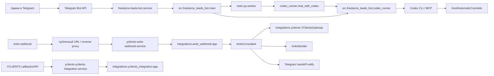
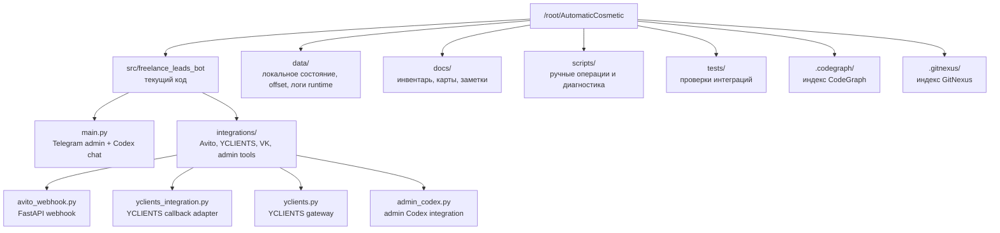
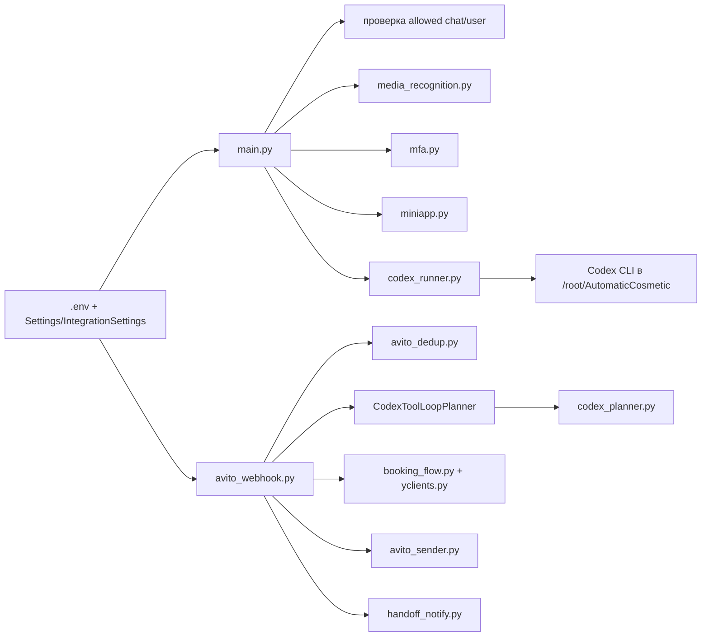

# Карта проекта AutomaticCosmetic

Обновлено: 2026-05-29.

Эта карта фиксирует текущую рабочую схему после уборки legacy-частей. Главная рабочая зона для Codex и нового Telegram-админ-бота: `/root/AutomaticCosmetic`.

## 1. Рантайм и внешние входы



Главное правило маршрутизации: админские Telegram-запросы к Codex должны идти через `freelance-leads-bot.service`, а не через старый `src.presentation.telegram.admin_bot`.

GitNexus подтверждает живой Codex-chat путь как `src/freelance_leads_bot/main.py:worker -> src/freelance_leads_bot/codex_runner.py:chat_with_codex`. Отдельный `src/freelance_leads_bot/integrations/telegram_admin_bot.py` остается в индексе как интеграционный transport и покрывается тестами, но он не является активным systemd entrypoint.

## 2. Активные systemd-сервисы

| Сервис | Рабочая директория | Что запускает |
|---|---|---|
| `freelance-leads-bot.service` | `/root/AutomaticCosmetic` | `/root/AutomaticCosmetic/.venv/bin/python -m src.freelance_leads_bot.main serve` |
| `yclients-avito-webhook.service` | `/root/AutomaticCosmetic` | `uvicorn src.freelance_leads_bot.integrations.avito_webhook:app --host 127.0.0.1 --port 8030 --no-access-log` |
| `yclients-yclients-integration.service` | `/root/AutomaticCosmetic` | `/root/AutomaticCosmetic/run_yclients_integration.sh` |

`yclients-tg-client.service` is masked and inactive because it used the old non-Codex Telegram client runtime.

Старые `yclients-tg-admin.service`, `yclients-avito-poller.service`, `yclients-vk-bot.service` и `yclients-asr.service` вынесены в quarantine и не должны поднимать старый Telegram admin polling.

## 3. Файловая карта



## 4. Где живет логика



## 5. Что считать live, а что не трогать без причины

Live:

- `/root/AutomaticCosmetic/src/freelance_leads_bot`
- `/root/AutomaticCosmetic/.venv`
- `/root/AutomaticCosmetic/data`
- systemd-сервисы из раздела 2

Служебные индексы:

- `.codegraph/` - текущий индекс CodeGraph для структурного поиска.
- `.gitnexus/` - индекс GitNexus, созданный командой `gitnexus analyze --index-only`.

Archive/quarantine:

- `/root/AutomaticCosmetic_archives/20260529_full_migration`
- там лежат бывшие `.legacy_runtime`, `.quarantine`, `legacy_integrations` и backup unit старого Telegram client service.

## 6. Быстрые проверки

```bash
systemctl status freelance-leads-bot.service
systemctl status yclients-avito-webhook.service
systemctl status yclients-yclients-integration.service
systemctl show yclients-tg-client.service --property=LoadState,ActiveState,UnitFileState

gitnexus status
gitnexus list
```

Если снова появится `409 Conflict` от Telegram polling, первым делом проверять, не запущен ли старый admin bot с тем же `TELEGRAM_BOT_TOKEN`.

## 7. Что показал GitNexus

- Индекс: `AutomaticCosmetic`, 108 файлов, 3200 symbols, 6121 edges, 226 flows.
- `chat_with_codex` имеет один прямой upstream caller: `main.py:worker`; риск изменения по GitNexus: LOW.
- `process_avito_message` вызывается из `avito_webhook.py:avito_webhook` и `scripts/avito_missed_message_poller.py:run_once`; риск изменения upstream: LOW.
- `/avito/webhook` и `/health` - два FastAPI route, которые GitNexus видит в текущем проекте.
- Legacy runtime больше не входит в активное дерево проекта; архив лежит в `/root/AutomaticCosmetic_archives/20260529_full_migration`.
